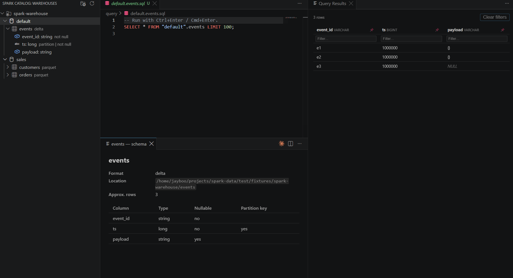

# Spark Local Catalog Explorer

Browse a local Spark/Hive warehouse the way [Databricks Unity Catalog](https://www.databricks.com/product/unity-catalog) browses tables — and query it with a Databricks-style SQL editor — all without needing a running Spark/JVM process.

## Features

- **Catalog tree**: Catalog → Database → Table → Column, read directly from your `spark-warehouse` directory layout (no Hive metastore / Derby DB required).
- **Schema viewer**: click a table for a webview with its columns, types, nullability, partition keys, format (Parquet or Delta), location, and approximate row count.
- **SQL editor**: write real SQL against your tables — `SELECT * FROM sales.orders WHERE region = 'us'` — and run it with `Ctrl+Enter` / `Cmd+Enter`. Backed by [DuckDB](https://duckdb.org/), which reads your Parquet files and Delta tables (`_delta_log` and all) directly.
- **Query results — pin & filter**: pin columns (📌) to keep them stuck to the left while scrolling, and filter rows per-column with the inline text boxes under each header. **Clear filters** resets every column at once.
- **Autocomplete**: type `db.` for real table names, `table.` (or an alias) for real column names, plus SQL keyword completion.
- **Works with both Parquet and Delta Lake tables**, including partitioned ones (Hive-style `key=value` partitioning is recovered automatically).

## Requirements

- A local Spark warehouse directory (the default output of `spark.sql(...)` / `df.write.saveAsTable(...)` in local `pyspark` / `spark-shell` sessions — typically a folder named `spark-warehouse`).
- No Java, JVM, or running Spark session needed to *browse or query* — everything reads the on-disk Parquet/Delta files directly.

## Getting started

1. Open a workspace folder that contains (or is near) your `spark-warehouse` directory, or click **Add Warehouse Folder...** (folder icon in the Spark Catalog view title bar) to point at one anywhere on disk.
2. Expand the tree to browse databases, tables, and columns.
3. Right-click a table → **New Query for Table** to open a pre-filled `.sql` file, or **New SQL Query** for a blank one. Files are created under `<workspace>/query/`.
4. Write SQL referencing tables as `database.table` (matches the tree naming) and press `Ctrl+Enter` — results open in a panel beside the editor.

## Configuration

| Setting | Description |
|---|---|
| `sparkCatalog.warehousePaths` | Paths to Spark warehouse directories (workspace-relative or absolute). If empty, auto-detects a `spark-warehouse` folder in each open workspace folder. |

## Commands

| Command | Description |
|---|---|
| Spark Catalog: Refresh | Re-scan the warehouse(s), bypassing the schema cache |
| Spark Catalog: Add Warehouse Folder... | Pick a folder via a native dialog and add it to `warehousePaths` |
| Spark Catalog: Show Schema | Open the schema webview for a table |
| Spark Catalog: New SQL Query | Open a blank query file |
| Spark Catalog: New Query for Table | Open a query file pre-filled for a specific table |
| Spark Catalog: Run Spark SQL Query | Run the current selection (or whole file) — bound to `Ctrl+Enter` / `Cmd+Enter` in `.sql` files |

## Known limitations

- SQL runs on **DuckDB**, not a real Spark session — the vast majority of everyday SQL (`SELECT`/`WHERE`/`JOIN`/`GROUP BY`/aggregates/CTEs) behaves the same, but two Databricks/Spark-SQL habits don't carry over: backtick-quoted identifiers aren't supported (use double quotes), and double-quoted strings are always treated as identifiers, never string literals (use single quotes for string values).
- Autocomplete uses a lightweight heuristic, not a full SQL parser — it won't follow CTEs or subquery-derived tables.
- Type mapping from Parquet/Delta to display names is best-effort, not a byte-perfect reproduction of Spark's `DESCRIBE TABLE`.

## License

[MIT](LICENSE)
